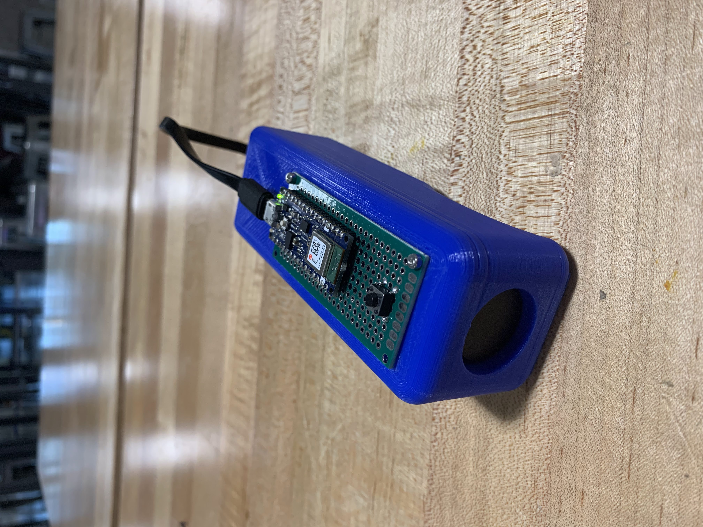
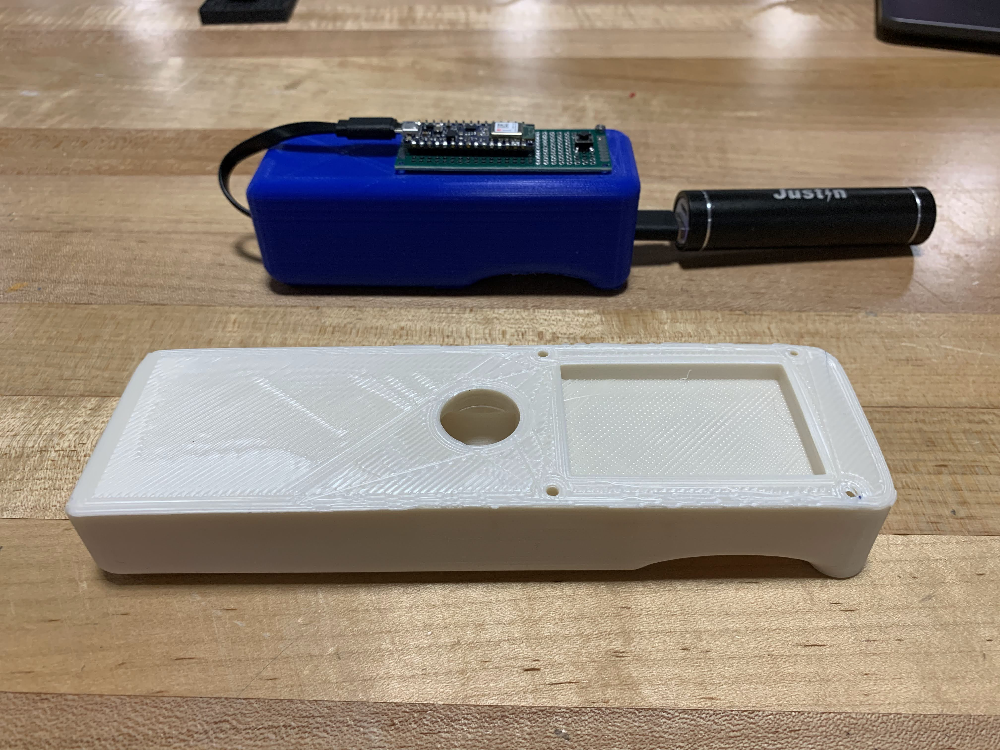
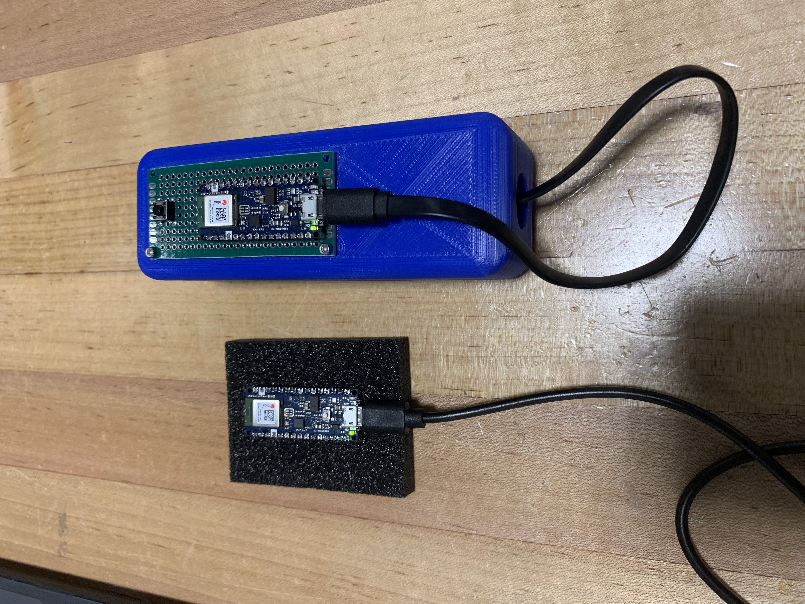

# CS 6360 Virtual Reality Final Project
# Real-time Handheld Gesture Classification for Virtual World Interaction
For my final project for CS 6360 I created a wireless, handheld, controller that could detect predetermined gestures using a machine learning gesture detection model. 
This gesture detection was integrated into the final homework of CS 6360 so the gestures could control the spin of the teacups. 

This project consisted of:

- Designing a 3D-printed controller using CAD that has:

  - On board battery

  - Arduino Arduino Nano BLE 33 (containing an on controller IMU) 

  - A button

- Bluetooth-based communication between two Arduino Nano BLE 33 microcontrollers, one connected to the base computer and the other onboard the controller and powered by the onboard battery

- Developing a Python-based machine learning gesture detection model, this consisted of:

  - Gathering training data consisting of 3-axis gyroscope readings, 3-axis accelerometer readings, and 3-axis magnetometer readings, for the following 6 predetermined gestures:

	- "Up" (denoted as label 1 = zero-based label 0)

	- "Right" (denoted as label 2 = zero-based label 1)

	- "Down" (denoted as label 3 = zero-based label 2)

	- "Left" (denoted as label 4 = zero-based label 3)

	- "Circle" (denoted as label 5 = zero-based label 4)

	- "x" (denoted as label 6 = zero-based label 5)

- Creating and integrating a python web API that can be "GET" requested for the current detected gesture with the final homework assignment VR application. 
Extending the behavior of this VR teacup visualization application to rotate the teacups based on the last detected gesture.

&nbsp;  

## About
I am a final year BS/MS Mechanical Engineering student who has been focused on robotics and computing since completing undergrad.

I decided to enroll in this class because I thought it would be interesting to learn about virtual reality and the engineering problems that lie in its domain.
During one of my internships augmented reality was being explored to help improve communication between manufacturing teams across the world so I really could see how virtual reality could have many far reaching applications, especially as I enter a career.

I completed all of the controller design, bluetooth interfacing code, data processing and machine learning training, and integration between gesture prediction and the VR application developed in class. 
The VR application was partially developed by me through homework assignments throughout the semester, the rest was created by the creators of Stanford's EE267 virtual reality class.

### Contact
Creator, Ryan Dalby, dalbyryan3@gmail.com

Faculty Sponsor, Rogelio E. Cardona-Rivera, Ph.D rogelio@cs.utah.edu

&nbsp;  

## Factsheet

- This project was completed by Ryan Dalby of Salt Lake City, Utah, located in the United States of America.

- Release date- December 13, 2021

- Platforms:
	- Hardware:
		- MacOS (should work with any OS that supports Python and has a modern web browser)
		- Custom designed controller
		- Arduino Nano BLE 33
		- VRduino 2 and Teensy 4.0/4.1
	- Software:
		- Arduino (Essentially C/C++) for bluetooth communication between controller and base station
		- Python and PyTorch for data processing, machine learning model training, and prediction
		- JavaScript and THREE.js for the VR application

- Project press kit is hosted using GitHub pages: https://dalbyryan3.github.io/cs-6360-virtual-reality-final-project/
- Project source code can be found on GitHub: https://github.com/dalbyryan3/cs-6955-deep-learning-final-project 

&nbsp;  

## Pitch

This project is the creation of a wireless bluetooth handheld controller that can detect predetermined gestures using a convolutional neural network gesture detection model and interface with a Javascript THREE.js virtual reality application to provide user gesture-based interaction with the virtual world.

This project is essentially and extension of this (http://stanford.edu/class/ee267/Spring2018/report_adu_bran-melendez.pdf) previous Stanford EE 267 project by Paa Adu and Stefan Bran-Melendez who created a gesture classifier for 6 different boxing movements. 

The previous project did not have a wireless/wearable IMU or real-time classification like this project does and this project utilizes a more complex machine learning architecture that can achieve over 97% accuracy on unseen test data as compared to max accuracy of 92.8% in the previous project (albeit on a different set of 6 different but similar gestures).

&nbsp;  

## History

This project came about by my desire to fuse some of my mechanical design skills, with some of my machine learning skills, along with the virtual reality skills learned in this class.

I was inspired by wanting to create a complete virtual reality platform from scratch and the main thing that was missing from the homeworks were some sort of non-keyboard/mouse user input device as found on most commercial virtual reality platforms

This project had many different components fusing mechanical design, C++/C Arduino development, Python data processing and PyTorch neural network model development, and a web-based virtual reality front-end.

It was decided to be done now because it fit in with previous final projects done for similar virtual reality classes and explored some of the challenges of virtual reality development, namely utilizing sensor feedback from the user to interact with the virtual reality graphics pipeline.

&nbsp;  

## Features

- Hold battery, microcontroller, and button components in handheld controller body

 

(The first controller prototype below, the final prototype above)

- Wirelessly send sensor data from controller to base station

(The base station on the left and the controller on the right)

- Collect labelled gestures from base station

(Labelled data with the filename of the csv holding the sensor readings as the first column, the label in the second column, and the sample time in the third column)

- Use labelled gesture data to produce a machine learning gesture model that can accurately predict gesture on unseen signal data 

(Error vs epoch plot showing between 0% and 2% error on a validation set when converged, the accompanying held-out test set error was 2.6%, more information about the training results can be found in training/models/gesture_model_12_12_2021_14_15_54.ipynb)

- Use gesture model to predict in real-time and have last predicted gesture accessible via a web API

- Alter spin of teacups in JavaScript virtual reality application based on result of querying the last detected gesture web API

&nbsp;  

## Video
"Feature highlight"- go through what was done by screen recording....

&nbsp;  

## Project Logo
As per instructions a logo that represents my project is:

This logo illustrates the wireless nature of the controller by the wireless antenna and signal lines.

The robot head implies this controller platform being the "brain"/"smart". 
This is in line with the project since the handheld controller is "smarter" than the average controller as it leverages machine learning to be able to predict on complex gestures (i.e. the "x" gesture).

<!-- Need to add 6 images for project -->

